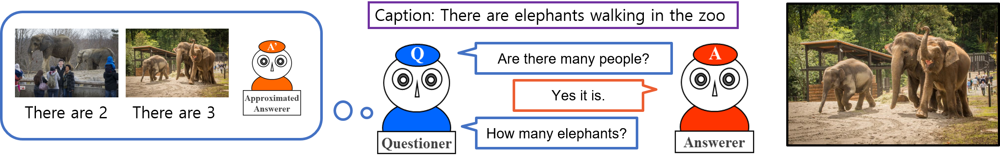
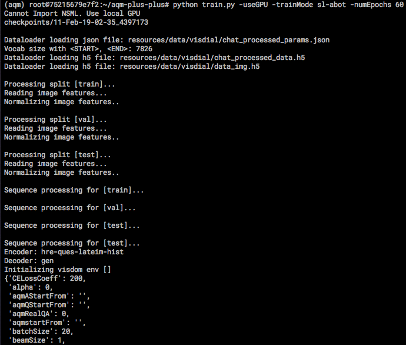
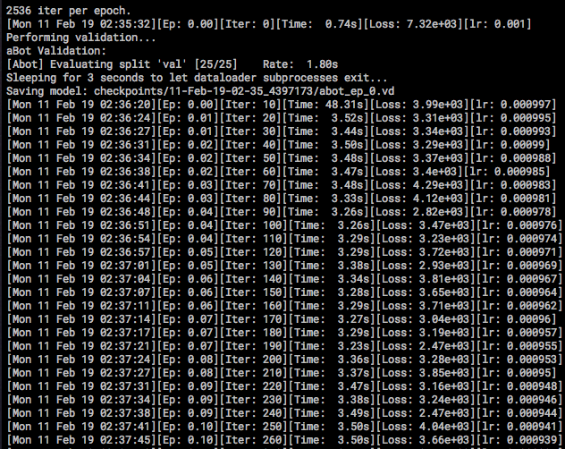
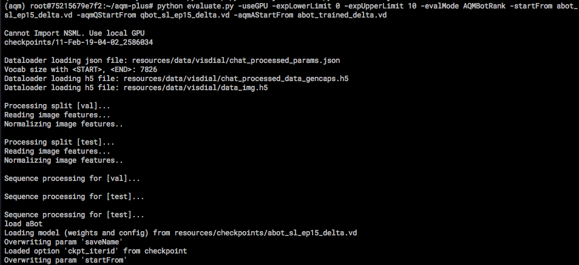
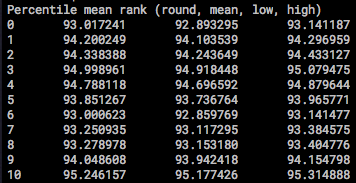
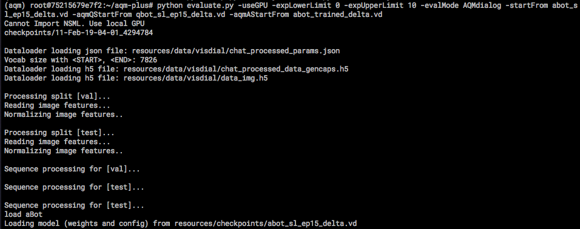
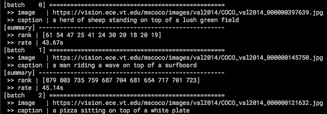
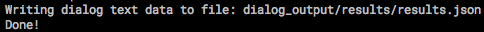
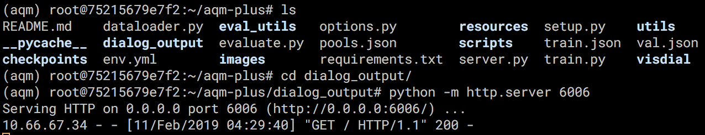
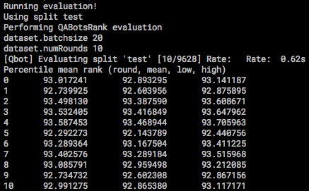

# AQM+

PyTorch(v0.3.1) implementation of the paper:

**[Large-Scale Answerer in Questioner's Mind for Visual Dialog Question Generation](https://openreview.net/forum?id=rkgT3jRct7&noteId=rkepgP_ggN)  
Sang-Woo Lee, Tong Gao, Sohee Yang, Jaejun Yoo, and Jung-Woo Ha  
ICLR 2019**

Answerer in Questioner’s Mind (AQM) [[Lee et al., 2018](https://arxiv.org/abs/1802.03881)] is an information-theoretic framework that has been recently proposed for task-oriented dialog systems. AQM benefits from asking a question that would maximize the information gain when it is asked. However, due to its intrinsic nature of explicitly calculating the information gain, AQM has a limitation when the solution space is very large.

To address this, we propose AQM+ that can deal with a large-scale problem and ask a question that is more coherent to the current context of the dialog. We evaluate our method on GuessWhich, a challenging task-oriented visual dialog problem, where the number of candidate classes is near 10K.

Our experimental results and ablation studies show that AQM+ outperforms the state-of-the-art models by a remarkable margin with a reasonable approximation. In particular, the proposed AQM+ reduces more than 60% of error as the dialog proceeds, while the comparative algorithms diminish the error by less than 6%. Based on our results, we argue that AQM+ is a general task-oriented dialog algorithm that can be applied for non-yes-or-no responses.

This code is based on the [PyTorch implementation](https://github.com/batra-mlp-lab/visdial-rl) of _Learning Cooperative Visual Dialog Agents using Deep Reinforcement Learning_ [[Das & Kottur et al., 2017](https://arxiv.org/abs/1703.06585)].

On top of the code for training the **questioner** and **answerer** bots described in [Das & Kottur et al., 2017], in **supervised** fashion and via **deep reinforcement learning** on the Visdial 0.5 dataset for the cooperative visual dialog task of _GuessWhich_, this repository contains code for training answerer bot in **depA** fashion of AQM+ and evaluating **AQM+ questioner**.  




## Preliminary: Important Terms

There are several important terms which are repeatedly used in the AQM+ paper. Those terms are also important in order to understand this guide. Although it should not be difficult to follow the guide if you have read the paper, here provided is a brief explanation for some of the important terms.


- Non-delta / Delta: Terms for different hyperparameter settings (See 4.1 of AQM+ paper)
  - Non-delta: A hyperparameter setting that [Das & Kottur et al., 2017] used in their paper.
  - Delta: A hyperparameter setting that [Das & Kottur et al., 2017] found and reported in their github repository, which makes much progress on their algorithm. It sets CELossCoeff to 1 and lrDecayRate to 0.999962372474343 during training.
  - There is no difference between the two settings in terms of interpretability. Delta setting is just a configuration of hyperparameters where the difference with non-delta setting is that it uses a different weight on one of the loss functions (the model of Das & Kottur et al. (2017b) optimizes the weighted sum of different loss functions) and a different value for learning rate decay. 
- indA / depA / trueA: Terms for different learning strategies of AQM framework. (See 3.4 of AQM+ paper)
  - indA
    - aprxAgen is trained from the training data.
  - depA
    - aprxAgen is trained from the questions in the training data and following answers obtained in the conversation between Qbot and Abot.
  - trueA
    - aprxAgen is the same as Agen, i.e. they share the same parameters.


## Data & Pretrained Checkpoints

We provide pretrained checkpoints for models from [Das & Kottur et al., 2017] and AQM+. All necessary checkpoints and data can be downloaded from [here](https://drive.google.com/file/d/1_rIX3mNbrLhP-xLWUAEWM1pY37apswsq/view?usp=sharing). Unzip `resources.zip` and put it under the root directory of this repository.


```
aqm-plus
|-- dialog_output
|-- eval_utils
|-- images
|-- resources
    |-- checkpoints
        |-- abot_rl_ep10.vd
        |-- ...
    |-- data
        |-- visdial
            |-- chat_processed_data.h5
            |-- ...
|-- scripts
|-- utils
|-- visdial
...
```


- Pretrained Checkpoints (inside `resources/checkpoints/`)
  - AQM+
    - Delta
      - qbot_sl_ep15_delta.vd
        - SL-trained Qbot. Downloaded from the github repository of [Das & Kottur et al., 2017].
        - In AQM+ setting, Used as Qgen of AQM+.
      - abot_sl_ep15_delta.vd
        - SL-trained Abot. Downloaded from the github repository of [Das & Kottur et al., 2017].
        - In AQM+ setting, used as Abot, and used as aprxAgen of AQM+ for trueA.
      - abot_trained_delta.vd
        - SL-trained Abot, but with a different random seed.
        - In AQM+ setting, used as aprxAgen of AQM+ for indA.
      - aqmbot_depon_delta.vd
        - Abot trained in depA manner.
        - Trained from the questions in the training data and following answers obtained in the conversation between Qbot(qbot_sl_ep15_delta.vd) and Abot(abot_sl_ep15_delta.vd).
        - In AQM+ setting, used as aprxAgen of AQM+ for depA.
    - Non-delta
      - qbot_sl_ep60.vd
        - SL-trained Qbot. Downloaded from the github repository of [Das & Kottur et al., 2017].
        - In AQM+ setting, Used as Qgen of AQM+.
      - abot_trained_60.vd
        - SL-trained Abot.
        - In AQM+ setting, used as Abot, and used as aprxAgen of AQM+ for trueA.
      - abot_sl_ep60.vd
        - SL-trained Abot, but with a different random seed. Downloaded from the github repository of [Das & Kottur et al., 2017].
        - In AQM+ setting, used as aprxAgen of AQM+ for indA.
      - aqmbot_depon_trained_ep60.vd
        - Abot trained in depA manner.
        - Trained from the questions in the training data and following answers obtained in the conversation between Qbot(qbot_sl_ep60.vd) and Abot(abot_trained_60.vd).
        - In AQM+ setting, used as aprxAgen of AQM+ for depA.
  - [Das & Kottur et al., 2017]
    - Delta
      - SL-Q
        - qbot_sl_ep15_delta.vd
          - SL-trained Qbot. Downloaded from the github repository of [Das & Kottur et al., 2017].
        - abot_sl_ep15_delta.vd
          - SL-trained Abot. Downloaded from the github repository of [Das & Kottur et al., 2017].
      - RL-QA
        - qbot_rl_ep20_delta.vd
          - RL-trained Qbot. Downloaded from the github repository of [Das & Kottur et al., 2017].
        - abot_rl_ep20_delta.vd
          - RL-trained Abot. Downloaded from the github repository of [Das & Kottur et al., 2017].
    - Non-delta
      - SL-Q
        - qbot_sl_ep60.vd
          - SL-trained Qbot. Downloaded from the github repository of [Das & Kottur et al., 2017].
        - abot_sl_ep60.vd
          - SL-trained Abot. Downloaded from the github repository of [Das & Kottur et al., 2017].
      - RL-QA
        - qbot_rl_ep20.vd
          - RL-trained Qbot. Downloaded from the github repository of [Das & Kottur et al., 2017].
        - abot_rl_ep20.vd
          - RL-trained Qbot. Downloaded from the github repository of [Das & Kottur et al., 2017].


## Setup & Dependencies

As we extended the code of [Das & Kottur et al., 2017], our code is implemented in PyTorch v0.3.1.

1. Install Python 3.6.

2. Install PyTorch v0.3.1, preferably with CUDA - running with GPU acceleration is highly recommended.

3. Get the source code:

   ```bash
   git clone https://github.com/naver/aqm-plus.git aqm-plus
   ```

4. Install requirements.

   ```bash
   pip install -r requirements.txt
   ```


## Training

AQM+ basically uses the same training schemes as suggested in [Das & Kottur et al., 2017], except for the training of aprxAgen of AQM+ for depA setting. Therefore, for our experiments, we mainly used the pretrained models [Das & Kottur et al., 2017] provided, and additionally trained Abot for indA (with only the difference of random seed) and Abot for depA. All the necessary checkpoints can be downloaded from [here](https://drive.google.com/file/d/1_rIX3mNbrLhP-xLWUAEWM1pY37apswsq/view?usp=sharing), as explained above. However, if you want to train your own models, here is a brief guide.


Random seed can be set using `-randomSeed <seed>`.


Checkpoints for Qbot obtained by training can be used as either Qbot or Qgen of AQM+ Qbot. They are stored inside `checkpoints/`.

- Training Qbot
  - Non-delta
    - `python train.py -useGPU -trainMode sl-qbot -numEpochs 60`
  - Delta
    - `python train.py -useGPU -trainMode sl-qbot -numEpochs 15 -CELossCoeff 1 -lrDecayRate 0.999962372474343`


Checkpoints for Abot obtained by training can be used as either Abot or aprxAgen of AQM+ Qbot. They are stored inside `checkpoints/`.

- Training Abot
  - Non-delta
    - `python train.py -useGPU -trainMode sl-abot -numEpochs 60`
  - Delta
    - `python train.py -useGPU -trainMode sl-abot -numEpochs 15 -CELossCoeff 1 -lrDecayRate 0.999962372474343`


- Training aprxAgen of AQM+ Qbot for depA setting
  - In order to train aprxAgen of AQM+ for depA setting, pretrained checkpoints for Qbot and Abot must be provided.
  - Non-delta
    - `python train.py -useGPU -trainMode aqmbot-dep -startFrom abot_trained_60.vd -qstartFrom qbot_sl_ep60.vd -numEpochs 60`
  - Delta
    - `python train.py -useGPU -trainMode aqmbot-dep -startFrom abot_sl_ep15_delta.vd -qstartFrom qbot_sl_ep15_delta.vd -numEpochs 15 -CELossCoeff 1 -lrDecayRate 0.999962372474343`


### Example

To train a non-delta Abot, run command `python train.py -useGPU -trainMode sl-abot -numEpochs 60`.

Preparation logs will be printed like this:




and then training logs will be printed.




Checkpoints will be saved at every epoch, under `checkpoints/<trainingStartedTime>/`.


## Evaluation

Here provided are the commands to evaluate models of AQM+ or [Das & Kottur et al., 2017] as in AQM+ paper. We first give a list of commands to run the models and then describe specific options in more detail.


### List of Basic Commands

- PMR

  - AQM+

    - Delta

      - indA
        -  `python evaluate.py -useGPU -expLowerLimit <lowerLimit> -expUpperLimit <upperLimit> -evalMode AQMBotRank -startFrom abot_sl_ep15_delta.vd -aqmQStartFrom qbot_sl_ep15_delta.vd -aqmAStartFrom abot_trained_delta.vd` 
      - depA
        -  `python evaluate.py -useGPU -expLowerLimit <lowerLimit> -expUpperLimit <upperLimit> -evalMode AQMBotRank -startFrom abot_sl_ep15_delta.vd -qstartFrom qbot_sl_ep15_delta.vd -aqmstartFrom aqmbot_depon_delta.vd` 

      - trueA
        -  `python evaluate.py -useGPU -expLowerLimit <lowerLimit> -expUpperLimit <upperLimit> -evalMode AQMBotRank -startFrom abot_sl_ep15_delta.vd -aqmQStartFrom qbot_sl_ep15_delta.vd -aqmAStartFrom abot_sl_ep15_delta.vd`

    - Non-delta
      - indA
        - `python evaluate.py -useGPU -expLowerLimit <lowerLimit> -expUpperLimit <upperLimit> -evalMode AQMBotRank -startFrom abot_trained_60.vd -aqmQStartFrom qbot_sl_ep60.vd -aqmAStartFrom abot_sl_ep60.vd` 
      - depA
        - `python evaluate.py -useGPU -expLowerLimit <lowerLimit> -expUpperLimit <upperLimit> -evalMode AQMBotRank -startFrom abot_trained_60.vd -qstartFrom qbot_sl_ep60.vd -aqmstartFrom aqmbot_depon_trained_ep60.vd` 
      - trueA
        - `python evaluate.py -useGPU -expLowerLimit <lowerLimit> -expUpperLimit <upperLimit> -evalMode AQMBotRank -startFrom abot_trained_60.vd -aqmQStartFrom qbot_sl_ep60.vd -aqmAStartFrom abot_sl_ep60.vd`
    - [Das & Kottur et al., 2017]
      - Delta
        - SL-Q
          - `python evaluate.py -useGPU -expLowerLimit <lowerLimit> -expUpperLimit <upperLimit> -evalMode QABotsRank -qstartFrom qbot_sl_ep15_delta.vd -startFrom abot_sl_ep15_delta.vd`
        - RL-QA
          - `python evaluate.py -useGPU -expLowerLimit <lowerLimit> -expUpperLimit <upperLimit> -evalMode QABotsRank -qstartFrom qbot_rl_ep20_delta.vd -startFrom abot_rl_ep20_delta.vd`
      - Non-delta
        - SL-Q
          - `python evaluate.py -useGPU -expLowerLimit <lowerLimit> -expUpperLimit <upperLimit> -evalMode QABotsRank -qstartFrom qbot_sl_ep60.vd -startFrom abot_sl_ep60.vd`
        - RL-QA
          - `python evaluate.py -useGPU -expLowerLimit <lowerLimit> -expUpperLimit <upperLimit> -evalMode QABotsRank -qstartFrom qbot_rl_ep20.vd -startFrom abot_rl_ep20.vd`

- Dialog

  - AQM+
    - Delta
      - indA
        - `python evaluate.py -useGPU -expLowerLimit <lowerLimit> -expUpperLimit <upperLimit> -evalMode AQMdialog -startFrom abot_sl_ep15_delta.vd -aqmQStartFrom qbot_sl_ep15_delta.vd -aqmAStartFrom abot_trained_delta.vd` 
      - depA
        - `python evaluate.py -useGPU -expLowerLimit <lowerLimit> -expUpperLimit <upperLimit> -evalMode AQMdialog -startFrom abot_sl_ep15_delta.vd -qstartFrom qbot_sl_ep15_delta.vd -aqmstartFrom aqmbot_depon_delta.vd` 
      - trueA
        - `python evaluate.py -useGPU -expLowerLimit <lowerLimit> -expUpperLimit <upperLimit> -evalMode AQMdialog -startFrom abot_sl_ep15_delta.vd -aqmQStartFrom qbot_sl_ep15_delta.vd -aqmAStartFrom abot_sl_ep15_delta.vd`
    - Non-delta
      - indA
        - `python evaluate.py -useGPU -expLowerLimit <lowerLimit> -expUpperLimit <upperLimit> -evalMode AQMdialog -startFrom abot_trained_60.vd -aqmQStartFrom qbot_sl_ep60.vd -aqmAStartFrom abot_sl_ep60.vd` 
      - depA
        - `python evaluate.py -useGPU -expLowerLimit <lowerLimit> -expUpperLimit <upperLimit> -evalMode AQMdialog -startFrom abot_trained_60.vd -qstartFrom qbot_sl_ep60.vd -aqmstartFrom aqmbot_depon_trained_ep60.vd` 
      - trueA
        - `python evaluate.py -useGPU -expLowerLimit <lowerLimit> -expUpperLimit <upperLimit> -evalMode AQMdialog -startFrom abot_trained_60.vd -aqmQStartFrom qbot_sl_ep60.vd -aqmAStartFrom abot_sl_ep60.vd`
  - [Das & Kottur et al., 2017]
    - Delta
      - SL-Q
        - `python evaluate.py -useGPU -expLowerLimit <lowerLimit> -expUpperLimit <upperLimit> -evalMode dialog -beamSize 5 -qstartFrom qbot_sl_ep15_delta.vd -startFrom abot_sl_ep15_delta.vd`
      - RL-QA
        - `python evaluate.py -useGPU -expLowerLimit <lowerLimit> -expUpperLimit <upperLimit> -evalMode dialog -beamSize 5 -qstartFrom qbot_rl_ep20_delta.vd -startFrom abot_rl_ep20_delta.vd`
    - Non-delta
      - SL-Q
        - `python evaluate.py -useGPU -expLowerLimit <lowerLimit> -expUpperLimit <upperLimit> -evalMode dialog -beamSize 5 -qstartFrom qbot_sl_ep60.vd -startFrom abot_sl_ep60.vd`
      - RL-QA
        - `python evaluate.py -useGPU -expLowerLimit <lowerLimit> -expUpperLimit <upperLimit> -evalMode dialog -beamSize 5 -qstartFrom qbot_rl_ep20.vd -startFrom abot_rl_ep20.vd`


### Explanation of Options


#### Must-be-included Options

 `python evaluate.py -useGPU -expLowerLimit <lowerLimit> -expUpperLimit <upperLimit>`

- To perform an evaluation, run  `evaluate.py`.
- To use GPU, specify `-useGPU`.
- Choose evaluation mode by setting `-evalMode <evalMode>`. Evaluation modes are listed below.
- Since AQM+ takes quite some inference time, it is recommended to run evaluations on parts of the whole dataset, by setting the lower limit and upper limit of test set images using `-expLowerLimit <lowerLimit>`  and `-expUpperLimit <upperLimit>`. Test set images inside the range `[lowerLimit, upperLimit)` are used. Limits can be a subrange of `[0, 9628)`. (There are 9628 images in the test set.)


#### Evaluation Modes

- PMR of SL or RL (Abot and Qbot of [Das & Kottur et al., 2017])
  - `-evalMode QABotsRank`
- PMR of AQM+
  - `-evalMode AQMBotRank`

- Dialog visualization of SL or RL (Abot and Qbot of [Das & Kottur et al., 2017])
  - `-evalMode dialog -beamSize 5`
    - [Das & Kottur et al., 2017] uses beam size of 5 as default.
- Dialog visualization of AQM+
  - `-evalMode AQMdialog`


#### Options for data location

`resources/` is used as the root data directory if no option is given and the directory exists.

If you want, it is okay to change the directory name to `data/`. The program will still run fine without the need of additional options.

If you want to change the root data directory to something other than `resources/` or `data/`, use `-dataRoot <directory>`.


##### For NSML users (in NAVER Corp.)

`run nsml -d <dataset> -e evaluate.py -a "<options>"` would automatically set the paths of data and checkpoints to those inside `<dataset>`. No additional options are necessary.

Use `aqm_all` as dataset if you don't want to upload your own.


#### Checkpoint options for AQM+

- Delta

  - indA

    - `-startFrom abot_sl_ep15_delta.vd`

      `-aqmQStartFrom qbot_sl_ep15_delta.vd`

      `-aqmAStartFrom abot_trained_delta.vd`

  - depA

    - `-startFrom abot_sl_ep15_delta.vd`

      `-qstartFrom qbot_sl_ep15_delta.vd`

      `-aqmstartFrom aqmbot_depon_delta.vd`

  - trueA

    - `-startFrom abot_sl_ep15_delta.vd`

      `-aqmQStartFrom qbot_sl_ep15_delta.vd`

      `-aqmAStartFrom abot_sl_ep15_delta.vd`

- Non-delta

  - indA

    - `-startFrom abot_trained_60.vd`

      `-aqmQStartFrom qbot_sl_ep60.vd`

      `-aqmAStartFrom abot_sl_ep60.vd`

  - depA

    - `-startFrom abot_trained_60.vd`

      `-qstartFrom qbot_sl_ep60.vd`

      `-aqmstartFrom aqmbot_depon_trained_ep60.vd`

  - trueA

    - `-startFrom abot_trained_60.vd`

      `-aqmQStartFrom qbot_sl_ep60.vd`

      `-aqmAStartFrom abot_sl_ep60.vd`


#### Options for Ablation Studies (4.3 & Appendix B)

- Guesser (Figure 3)
  - This does not calculate information gain; it uses beam search of beam size 1 to make the question.
  - `-onlyGuesser 1`
- No Caption (Figure 4a, 8a)
  - Zero Caption
    - `-zeroCaption 1`
  - Random Caption
    - `-randomCaption 1`
- Random Candidate Answer (Figure 4b)
  - `-randA 1 -resampleEveryDialog 1`
- Number of Q (Figure 5b)
  - `-numQ <numberOfQuestions>`
- Number of A (Figure 5c)
  - `-numA <numberOfAnswers>`
- number of C (Figure 5d)
  - `-numImg <numberOfImages>`
- AQM+'s Qinfo + SL's Qscore (Figure 9)
  - `-slGuesser 1`
- gen1Q (Figure 10)
  - `-gen1Q <numberOfQuestions>`
- randQ (Figure 11)
  - `-randQ 1 -resampleEveryDialog 1`
- No History (Figure 12)
  - `-noHistory 1`


#### Other Options

By default, the program shows the conversation between Qbot and Abot while calculating the PMR. To disable this, set `-showQA 0`.

To save logs for analysis, e.g. image-wise and turn-wise rank/qa pair/image url, set `-saveLogs 1`.


### Example

#### PMR

To evaluate the PMR of delta indA model of test set images from 0 to 9, run command `python evaluate.py -useGPU -expLowerLimit 0 -expUpperLimit 10 -evalMode AQMBotRank -startFrom abot_sl_ep15_delta.vd -aqmQStartFrom qbot_sl_ep15_delta.vd -aqmAStartFrom abot_trained_delta.vd` .


Preparation logs will be printed like this:




evaluation logs will be printed like this:


After the evaluation, PMR will be printed.




#### Dialog

To evaluate the PMR of delta indA model of test set images from 0 to 9, run command `python evaluate.py -useGPU -expLowerLimit 0 -expUpperLimit 10 -evalMode AQMBotRank -startFrom abot_sl_ep15_delta.vd -aqmQStartFrom qbot_sl_ep15_delta.vd -aqmAStartFrom abot_trained_delta.vd`


Preparation logs will be printed like this:




and then the evaluation logs will be printed.




When the evaluation is done, the dump result will be saved in `dialog_output/results/` as `results.json`.




To see the dumped dialogs, move into `dialog_output/` and run `python -m http.server <port>`.




Then access `<server_ip>:<port>` on your web browser.


#### PMR of [Das & Kottur et al., 2017]

To evaluate the PMR of Delta SL-Q of [Das & Kottur et al., 2017] of test set images from 0 to 9, run command `python evaluate.py -useGPU -expLowerLimit 0 -expUpperLimit 10 -evalMode QABotsRank -qstartFrom qbot_sl_ep15_delta.vd -startFrom abot_sl_ep15_delta.vd`.


After the evaluation, the PMR of test set images [0:10) will be printed like this.




## References

If you use this code as part of any published research, please cite **_[S.-W. Lee, T. Gao, S. Yang, J. Yoo, and J.-W. Ha, Large-Scale Answerer in Questioner's Mind for Visual Dialog Question Generation, 2019](https://openreview.net/forum?id=rkgT3jRct7&noteId=rkepgP_ggN)_**.


## Acknowlegement

This code is based on the github repository

_[N. Modhe, V. Prrabhu, M. Cogswell, S. Kottur, A. Das, S. Lee, D. Parikh, and D. Batra, VisDial-RL-PyTorch, 2018](https://github.com/batra-mlp-lab/visdial-rl.git)_

which is the official PyTorch implementation of

_[A. Das, S. Kottur, J. Moura, S. Lee, and D. Batra, Learning Cooperative Visual Dialog Agents with Deep Reinforcement Learning, 2017](https://arxiv.org/abs/1703.06585)_.

We would like to thank the authors of the work.


## Code Authors

- Sohee Yang [github](https://github.com/soheeyang)
- Tong Gao [github](https://github.com/gaotongxiao)


## License

Copyright (c) NAVER Corp.
Licensed under [BSD 3-clause](LICENSE.md)


## Help / Issues

For help or issues regarding the code, please submit a github issue.

Reading the readme of [VisDial-RL-PyTorch](https://github.com/batra-mlp-lab/visdial-rl) would help as well.
